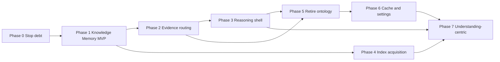

# Migration Roadmap — Knowledge OS (RFC-0001)

**Status:** Active  
**Parent:** `docs/RFC-0001-KNOWLEDGE-OS-CORE.md`  
**Vision:** `docs/KNOWLEDGE_INTELLIGENCE_ENGINE.md`  
**Near-term build:** `docs/SEMANTIC_UNDERSTANDING_MVP.md`

This document is the codebase audit and phased migration plan mandated by RFC-0001. Refactor **incrementally**. Maintain backward compatibility. Do not rewrite everything at once.

---

## Current state summary

| Dimension | Assessment |
|-----------|------------|
| **Overall maturity** | Retrieval-centric (late), with document-centric storage |
| **Closest to vision** | `SemanticCompatibilityScorer`, `QueryUnderstandingService`, simplified retrieval presets |
| **Missing entirely** | Knowledge Memory, Knowledge Reasoning, site-wide concept index, self-evaluation |
| **Largest debt** | Industry presets, document-type ontology, admin boost tables, per-page-only intelligence |

### Maturity by subsystem

| Subsystem | Maturity | Primary issue |
|-----------|----------|---------------|
| Crawler / indexing | Document-centric | Success = chunks indexed, not knowledge learned |
| Source Intelligence | Document-centric | Fixed type/role taxonomy drives canonical/importance |
| Knowledge Profile generation | Document-centric + tuning | Industry presets, URL category patterns, page-as-node graph |
| Retrieval pipeline / engine | Retrieval-centric | Chunk→document→score is the core loop |
| RAG / chat | Retrieval-centric | Pipeline identity is retrieve→LLM |
| Knowledge Profile service | Retrieval-centric config | Boost tables, industry presets, URL heuristics |
| Canonical source service | Document-centric | Preferred `document_type` lists |
| Context builder | Document-centric | Assembles page bodies with `Type: {document_type}` |
| Settings / dashboard | Retrieval-centric | Boost knobs, manual profile editor |
| Cache layer | Retrieval-centric | Caches chunk hits, keyed on tuning state |
| Hybrid retrieval (legacy) | Retrieval-centric | Test-only; should be deleted |

---

## Cross-cutting findings

### 1. Documents assumed instead of knowledge

- `Source` / `Chunk` ORM is the primary knowledge artifact
- Indexing reports `"{n} chunks"` not concept deltas
- Context builder groups by `source_id` and labels `document_type`
- Diagnostics expose `candidate_pages`, score breakdowns
- Profile-gen “knowledge graph” uses `page:` and `cat:` nodes

### 2. Retrieval treated as primary architecture

- `rag_service` / `rag_streaming`: normalize → cache → retrieve → LLM
- `DocumentFirstRetrievalPipeline` is the production core
- SI LLM prompt frames task as “for a RAG system”
- Caches short-circuit on chunk retrieval hits

### 3. Hardcoded business assumptions

| Pattern | Key locations |
|---------|---------------|
| `document_type` / `page_role` enums | `source_intelligence_constants.py`, `source_intelligence_service.py`, indexing |
| Industry presets (`bank_financial`, etc.) | `knowledge_profile_service.py`, `profile_assembler.py`, `structure_analyzer.py` |
| URL heuristics | `_generic_document_type_rules()`, `_CATEGORY_PATTERNS`, `content_category_service.py` |
| Intent frozensets + manual boosts | `source_intelligence_router.py`, `query_understanding.py` |
| Closed-world ontology | `source_intelligence.py` `GENERIC_*` frozensets |
| Bank-specific entity regex | `entity_extractor.py` `_ENTITY_PATTERNS` |

### 4. Admin configuration compensates for missing intelligence

- Knowledge Profile editor + 7 industry presets
- `boost_document_types` / `deprioritize_document_types` rules
- Canonical/news deprioritization toggles
- Profile change → forced reindex
- Homepage/title/heading boost sliders (advanced settings)

### 5. Information stored, not understood

- Per-page SI JSON on `Source` — no site-wide merge
- Chunk embeddings without concept dedup or contradiction detection
- Dead DB columns: `document_priorities_json`, `scoring_weights_json`, `intent_profiles_json` (no runtime consumers)

---

## Evolution path

```
Phase 0–1   Document-centric     (current storage model)
Phase 2–3   Retrieval-centric    (current production path — improving)
Phase 4–5   Knowledge-centric    (site-wide memory, evidence routing)
Phase 6–7   Understanding-centric (reasoning-first, self-evaluation)
```

Each phase is **additive** and **backward compatible** unless explicitly marked deprecated.

---

## Phase 0 — Stop the debt

**Goal:** Halt new hardcode; remove dead paths without changing production behavior.

### Architecture changes

- Mark industry presets and boost tables as **deprecated** in code comments and docs
- Delete `HybridRetrievalService` from production imports (already bypassed); migrate remaining tests
- Remove runtime references to dead JSON weight columns (already unused)

### Reasoning

Cannot build Knowledge OS on top of growing tuning surface. Dead code and unused columns create false confidence that admin knobs still work.

### Expected improvements

- Clearer codebase boundaries
- Tests reflect production path only
- No admin expectation of dead settings fields

### Migration safety

- **High** — hybrid path already bypassed; JSON weight columns have no consumers
- Feature flags unchanged; chat behavior identical

### Risks

- Test suite churn when removing hybrid tests — rewrite against `DocumentFirstRetrievalPipeline`

### Tests

- `test_hybrid_*` → migrate or delete
- Assert no production import of `hybrid_retrieval_service`
- Assert `document_priorities_json` not read in `app/services/`

### Deliverables

- [ ] Deprecation notices on `PRESETS`, `build_boost_tables()`, industry preset API
- [ ] Hybrid retrieval removed from non-test code paths
- [ ] Audit doc updated when complete

---

## Phase 1 — Knowledge Memory MVP

**Goal:** Site-wide semantic memory from existing Source Intelligence — first step toward “index understanding, not pages.”

**Build spec:** `docs/SEMANTIC_UNDERSTANDING_MVP.md`

### Architecture changes

```
Source Intelligence (per-page)
  ↓
Understanding Builder          ← NEW
  ↓
Understanding Store              ← NEW (concept index + evidence links)
  ↓
(existing retrieval pipeline — unchanged initially)
```

New modules:

```
backend/app/services/knowledge_understanding/
  interface.py       # KnowledgeUnderstandingLayer protocol
  builder.py         # SI → concepts + evidence links
  store.py           # persistence
  resolver.py        # query → knowledge need (shadow mode)
  evidence_finder.py # need → source candidates (shadow mode)
```

Hook: rebuild after `SourceIntelligenceGenerationService` batch completes.

API: `GET /api/understanding/summary` (read-only coverage).

### Reasoning

Per-page SI is the richest signal already produced. Aggregating it into site-wide memory is the lowest-risk path to Knowledge Memory without re-indexing everything differently.

### Expected improvements

- System can answer: “what concepts does this site explain?”
- Foundation for reasoning layer
- Admin visibility into coverage gaps (not ontology editing)

### Migration safety

- **High** — additive tables; no change to chat until Phase 2
- Shadow mode only; `enable_knowledge_understanding = False` default

### Risks

- Concept explosion without embedding merge
- Stale memory if not tied to `knowledge_version`

### Tests

- `test_understanding_builder.py` — SI → concept/evidence links
- `test_understanding_normalizer.py` — alias merge, no domain regex
- `test_understanding_no_hardcode.py` — no `_ENTITY_PATTERNS`-style tables in path

### Deliverables

- [ ] DB migration: `understanding_snapshots`, `understanding_concepts`, `understanding_evidence`
- [ ] Builder + store + rebuild hook
- [ ] Summary API + dashboard read-only panel

---

## Phase 2 — Evidence routing (retrieval as tool)

**Goal:** Understanding layer **assists** document-first retrieval; retrieval demoted from core to tool.

### Architecture changes

```
QueryUnderstanding
  ↓
Understanding Resolver           ← NEW (assist mode)
  ↓
Evidence Finder                  ← NEW
  ↓
merge(vector_candidates, understanding_candidates)
  ↓
DocumentFirstRetrievalPipeline   ← existing, receives understanding_score
  ↓
Context Builder → LLM
```

- Soft internal boost from `understanding_score` in `DocumentScorer` (fixed blend, not admin-tunable)
- Feature flag: `enable_knowledge_understanding`

### Reasoning

Proves RFC principle “retrieval is a service” without rewriting RAG. Vector search remains fallback; understanding routes evidence when it adds value.

### Expected improvements

- +10% correct page in top-3 on broad/overview queries (offline target)
- Diagnostics: `understanding_trace` with human `why`

### Migration safety

- **Medium** — flag-gated; default off until eval passes
- Rollback: disable flag, zero behavior change

### Risks

- Understanding candidates may pollute ranking if merge weights wrong
- Latency budget (+20ms target for resolver)

### Tests

- `test_understanding_retrieval.py` — shadow + assist integration
- Offline eval script: graph seeds vs ideal sources
- Regression suite for existing semantic retrieval tests

### Deliverables

- [ ] Resolver + evidence finder wired into `RetrievalPipelineService`
- [ ] `understanding_trace` in debug diagnostics
- [ ] Assist mode enabled after offline eval

---

## Phase 3 — Knowledge Reasoning shell

**Goal:** Introduce reasoning pipeline **wrapper** around retrieval; diagnostics shift from scores to semantic decisions.

### Architecture changes

```
User query
  ↓
KnowledgeReasoningService        ← NEW (orchestrator)
  ├── resolve information need
  ├── locate concepts (Understanding Store)
  ├── gather evidence (Evidence Finder + Retrieval as tool)
  ├── evaluate sufficiency / contradictions
  ├── detect gaps
  └── assemble evidence bundle + confidence
  ↓
Context Builder → LLM → Self-evaluation
```

New:

```
backend/app/services/knowledge_reasoning/
  service.py           # orchestrator
  evidence_evaluator.py  # sufficiency, independence, contradiction
  confidence.py        # evidence-quality-derived confidence
  self_evaluation.py   # should answer or admit uncertainty
```

`RetrievalPipelineService.run()` called **from** reasoning service, not from `rag_service` directly.

### Reasoning

RFC requires reasoning before search. Wrapper pattern avoids big-bang rewrite while making reasoning the entry point for chat.

### Expected improvements

- Diagnostics answer RFC questions: what knowledge needed, why selected, what's missing
- Answers include confidence from evidence quality
- “I don't know” when evidence insufficient

### Migration safety

- **Medium** — refactor call chain in `rag_service` / `rag_streaming`
- Keep `RetrievalPipelineService.run()` signature stable initially

### Risks

- Double latency if reasoning steps not bounded
- Incomplete contradiction detection may over-refuse answers

### Tests

- `test_knowledge_reasoning.py` — end-to-end reasoning flow
- `test_self_evaluation.py` — insufficient evidence → uncertainty response
- Diagnostics snapshot tests (human strings, not score keys)

### Deliverables

- [ ] `KnowledgeReasoningService` as chat entry point
- [ ] RFC-style diagnostics in chat debug payload
- [ ] Self-evaluation gate before LLM answer

---

## Phase 4 — Knowledge acquisition on index

**Goal:** Index pass emits **knowledge deltas**, not just chunks.

### Architecture changes

```
Crawl → Extract text → SI → Understanding delta → Chunk/embed (evidence)
                              ↑
                    "I learned something new"
```

- Indexer callback: after SI, call `UnderstandingIncrementalUpdater` for one source
- Metrics: concepts discovered/strengthened/contradicted per run
- `Source` demoted to evidence artifact in docs and diagnostics naming

### Reasoning

RFC: “Instead of indexing pages, index understanding.” Incremental updater avoids full rebuild on every page.

### Expected improvements

- Knowledge Memory stays fresh during long crawls
- Indexing dashboard shows learning metrics, not just chunk counts

### Migration safety

- **Medium** — incremental updates must be idempotent
- Full rebuild remains fallback on `knowledge_version` bump

### Risks

- Race conditions during parallel indexing workers
- Partial understanding during incomplete crawls

### Tests

- `test_understanding_incremental.py` — upsert/delete per source
- Concurrent indexing stress test

### Deliverables

- [ ] Incremental updater hooked from indexing worker
- [ ] Index job reports concept deltas
- [ ] Dashboard: “knowledge learned this run”

---

## Phase 5 — Retire document-type ontology

**Goal:** Remove industry presets, boost tables, and type-driven canonical selection.

### Architecture changes

**Remove or no-op:**

- `PRESETS["bank_financial"]` etc. — API returns deprecation
- `build_boost_tables()`, `SourcePriorityRule` runtime effect
- `CanonicalSourceService` preferred `document_type` lists → understanding-based canonical
- `source_intelligence_constants.py` fixed taxonomy → open vocabulary from SI
- `entity_extractor.py` `_ENTITY_PATTERNS` → SI-only extraction

**Keep temporarily (structural, not business):**

- `document_type` as crawl artifact label until SI fully replaces it
- `LOW_OVERVIEW_DOCUMENT_TYPES` only if reframed as structural HTML signals, not business categories

### Reasoning

RFC golden rule: engine must not know it's indexing a bank. Presets and type tables are the opposite.

### Expected improvements

- Zero industry-specific code paths
- New verticals work without preset selection
- Admin surface shrinks to URL + index

### Migration safety

- **Low–Medium** — behavior change for sites relying on bank preset boosts
- Mitigation: Phase 2 understanding routing must be live first
- Migration period: log when deprecated rules would have fired

### Risks

- Temporary quality regression for sites tuned via bank preset
- Large test fixture update

### Tests

- `test_no_industry_presets_in_production_path`
- Generic corporate + docs site fixtures only for retrieval regression
- Canary: compare answer quality before/after on sample queries

### Deliverables

- [ ] Preset API deprecated
- [ ] Boost tables no-op in production scorer
- [ ] Canonical from understanding layer
- [ ] Knowledge Profile UI → read-only understanding coverage

---

## Phase 6 — Cache and settings alignment

**Goal:** Cache reasoning outcomes; collapse settings to ops-only.

### Architecture changes

- Cache namespace keyed on `understanding_version`, not boost settings
- Answer cache includes evidence set hash + understanding version
- Remove from API/UI: `title_match_boost`, `homepage_boost_*`, news deprioritization toggles (DB columns deprecated)
- Retain: `top_k`, retrieval mode presets (Automatic/Fast/Balanced/High Precision), timeouts, models

### Reasoning

RFC: discovery over configuration. Caching chunk hits without understanding context violates “reasoning first.”

### Expected improvements

- Cache hits only when evidence + understanding unchanged
- Admin cannot misconfigure retrieval into compensating for bad understanding

### Migration safety

- **Medium** — cache invalidation on understanding version bump
- One-time cache flush on deploy

### Risks

- Lower cache hit rate initially
- Settings migration for existing deployments

### Tests

- `test_cache_namespace_understanding_version`
- Answer cache rejected when understanding version stale

### Deliverables

- [ ] Cache namespace refactor
- [ ] Settings schema cleanup (deprecated fields hidden)
- [ ] Advanced boost sliders removed from dashboard

---

## Phase 7 — Understanding-centric platform

**Goal:** Full RFC-0001 alignment — Knowledge OS as the product.

### Architecture changes

- Rename internal concepts: `RetrievalPipelineService` → called only from `KnowledgeReasoningService`
- Chat/search/analytics as interfaces over same reasoning core
- Multi-site `understanding_snapshots` keyed by site
- Temporal reasoning hooks (concept `first_seen`, `last_updated`, obsolete detection)
- Analytics feeds back into concept confidence (usage patterns)

### Reasoning

RFC future evolution: multiple websites, agents, scheduled learning — requires reasoning core to be the shared platform layer.

### Expected improvements

- Unknown website indexes with zero admin config
- Coherent internal model like a human expert
- Every indexing run makes the engine smarter

### Migration safety

- **Low** — major version; feature-complete prior phases required

### Risks

- Scope creep; must not rewrite working paths

### Tests

- End-to-end: index unknown site fixture → ask questions → verify understanding trace
- No `document_type` in diagnostics output
- Self-evaluation triggers uncertainty on gap queries

---

## Phase dependency graph



**Recommended next work:** Phase 0 (quick) → Phase 1 (Knowledge Memory MVP).

---

## Architectural decision checklist (per PR)

Before merging any PR touching intelligence/retrieval:

1. Does this make the engine smarter?
2. Does this reduce manual work?
3. Does this increase understanding?
4. Does this work for unknown websites?
5. Can this emerge automatically?
6. Am I adding a rule, or adding intelligence?

If adding a rule → **redesign**.

---

## Document maintenance

Update this roadmap when:

- A phase completes (check deliverables)
- Audit findings change after refactors
- New subsystems are added

**Last audit:** 2026-07-04 (RFC-0001 initial codebase review)
