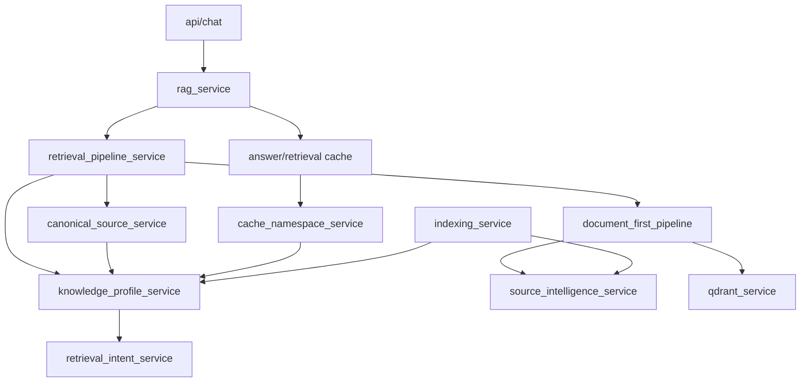

# RFC-100: Production Migration Strategy

**Status:** Engineering execution plan  
**Scope:** Zero-downtime evolution to Knowledge OS Architecture v1  
**Frozen inputs:** `COGNITIVE_ARCHITECTURE.md`, `KNOWLEDGE_OS_ARCHITECTURE_v1.md` — do not redesign  
**Constraint:** Safe evolution of live production; no big-bang rewrite

---

## Executive summary

The production system is a **working RAG pipeline** with a **partial semantic layer** (`DocumentFirstRetrievalPipeline`, `SemanticCompatibilityScorer`). Migration strategy: **strangler fig** — wrap, shadow, cut over, deprecate — with **feature flags**, **parity tests**, and **memory version** gating caches.

**Golden rule:** Every release compiles, passes tests, deploys, rolls back, and ships measurable value.

**Estimated horizon:** 6–9 months at steady pace (not calendar commitment — effort guide).

---

# 1. CURRENT CODEBASE ASSESSMENT

## 1.1 Repository layout

| Area | Path | Role |
|------|------|------|
| Backend API | `backend/app/api/` | HTTP interfaces (chat, indexing, settings, analytics…) |
| Core | `backend/app/core/` | Config, DB, concurrency, logging |
| Models | `backend/app/models/` | ORM (Source, Chunk, Settings, traces…) |
| Repositories | `backend/app/repositories/` | Data access |
| Schemas | `backend/app/schemas/` | Pydantic API contracts |
| Services | `backend/app/services/` | Business logic (~130 modules) |
| Tests | `backend/tests/` | 41 test modules |
| Dashboard | `dashboard/src/` | Admin UI (~165 TS/TSX files) |
| Migrations | `backend/migrations/` | Alembic |

## 1.2 Package inventory → target subsystem

Legend: **Effort** S ≤3d, M ≤1.5wk, L ≤3wk, XL >3wk. **Risk** L/M/H.

### API layer

| Package / module | Purpose today | Current responsibility | Future subsystem | Action | Debt | Risk | Deps | Effort |
|------------------|---------------|------------------------|------------------|--------|------|------|------|--------|
| `api/chat.py` | Chat + stream | Instantiates `RagService` directly | Interface → Executive | Refactor | No orchestration layer | M | RagService | M |
| `api/indexing.py` | Index jobs | Crawl/reprocess triggers | Indexing Gateway → Executive | Refactor | Fat routes | L | workers, indexing | M |
| `api/knowledge_profile.py` | Profile CRUD + presets | Manual ontology API | **Deprecated** | Deprecate | RFC violation | M | KP service | M |
| `api/knowledge_profile_generate.py` | Profile wizard | Semi-auto rules generation | Claim Extraction (preview) | Refactor | Emits boost rules | M | KP gen | L |
| `api/settings.py` | Agent config | 200+ fields incl. boosts | Ops config only | Refactor | Dead JSON columns | M | models | M |
| `api/analytics.py` | Metrics API | Intent/score aggregates | Analytics | Refactor | Not epistemic health | L | analytics_svc | M |
| `api/sources.py`, `traces.py`, `health.py`, `overview.py` | Ops | CRUD / health | Infrastructure | Keep | — | L | repos | S |

### Chat / RAG path (critical path)

| Module | Purpose | Current responsibility | Future | Action | Debt | Risk | Effort |
|--------|---------|------------------------|--------|--------|------|------|--------|
| `rag_service.py` | Non-stream chat | Cache → pipeline → LLM → polish; **god class** | Executive + Reasoning + Language | Refactor | ~1000 lines, owns too much | **H** | XL |
| `rag_streaming.py` | SSE chat | Wraps RagService + pipeline | Executive + Reasoning + Language | Refactor | Duplicates rag path | **H** | L |
| `chat_response_builder.py` | Response assembly | Diagnostics packaging | Diagnostics + Language | Refactor | Score-centric fields | M | M |
| `retrieval_pipeline_service.py` | Retrieval orchestrator | Intent, expansion, pipeline, canonical, inject; **god class** | Executive + Reasoning + Evidence Assembly | Split | 460+ lines | **H** | XL |
| `retrieval_engine/pipeline.py` | Document-first retrieval | Chunk→doc→score→rerank | Evidence Assembly (partial) | Refactor | Named “RAG” | M | L |
| `retrieval_engine/query_understanding.py` | Query analysis | Information need signals | **Reasoning** | Keep | Minor purpose maps | L | S |
| `retrieval_engine/semantic_compatibility.py` | SI scoring | Claim-site fit proxy | Reasoning + Memory views | Keep→move | — | M | M |
| `retrieval_engine/document_scorer.py` | Blend scores | Weighted fusion | Reasoning | Refactor | Fixed blends | M | M |
| `retrieval_engine/document_reranker.py` | Selection + why | Purpose diversity | Reasoning | Keep | — | L | S |
| `retrieval_engine/explanation_builder.py` | Human why strings | Explainability | Diagnostics / Reasoning | Keep | — | L | S |
| `retrieval_engine/retrievers.py` | Dense+lexical | Qdrant + lexical | Evidence Assembly | Refactor | — | M | M |
| `retrieval_engine/context_builder.py` | LLM context | Page bodies | Language + Evidence Assembly | Refactor | document_type in header | M | M |
| `retrieval_engine/prompt_builder.py` | Prompt templates | Intent branching | Language | Refactor | Intent frozensets | M | M |
| `hybrid_retrieval_service.py` | Legacy chunk fusion | Test-only path | — | **Remove** | Dead in prod | L | S |
| `canonical_source_service.py` | Context ordering | Doc-type boost lists | Memory authority | Replace | Profile-driven | M | M |
| `context_builder_service.py` | Legacy context | Page blocks | Evidence Assembly | Merge | Duplicate | L | S |

### Indexing / world I/O

| Module | Purpose | Future | Action | Debt | Risk | Effort |
|--------|---------|--------|--------|------|------|--------|
| `indexing_service.py` | Single-source index | Extract, classify, chunk, embed | Indexing Gateway + Observation Processing | Refactor | document_type at index | M | L |
| `indexing_worker_service.py` | Background jobs | Full site index | Executive + Gateway | Refactor | — | M | L |
| `crawler_service.py`, `sitemap_service.py` | URL frontier | Crawl | Indexing Gateway | Keep | — | L | S |
| `reprocess_service.py` | Re-extract/re-embed | Maintenance precursor | Gateway + Observation | Refactor | doc_type filter | M | M |
| `chunking_service.py`, `embedding_service.py` | Chunk/embed | Sensory prep | Observation + Evidence Assembly | Keep | — | L | S |
| `qdrant_service.py`, `lexical_index_service.py` | Search indexes | Sensory index | Evidence Assembly | Keep | — | M | S |
| `html_parser_service.py`, parsers | Extract text | Observation Processing | Refactor | — | L | M |

### Source Intelligence → Claim Extraction

| Module | Purpose | Future | Action | Debt | Risk | Effort |
|--------|---------|--------|--------|------|------|--------|
| `source_intelligence_service.py` | Per-page profile | Structural + semantic JSON | Claim Extraction + Integration | Refactor | Type taxonomy | M | L |
| `source_intelligence_llm_service.py` | LLM profiles | Semantic JSON | Claim Extraction | Refactor | “RAG” framing in prompt | M | M |
| `source_intelligence_generation_service.py` | Batch SI | Async worker | Executive-scheduled extraction | Refactor | — | M | M |
| `source_intelligence_worker_service.py` | Worker | Queue consumer | Scheduler/Executive | Keep | — | L | S |
| `source_semantic_rules.py` | Rules fallback | Role→purpose maps | Claim Extraction (fallback) | Refactor | Doc-type centric | M | M |
| `source_intelligence_constants.py` | Taxonomies | GENERIC_* enums | Deprecate gradually | Refactor | Hardcoded ontology | M | M |
| `source_intelligence_router.py` | Chunk boosts | Intent boosts (parallel path) | Remove from hot path | Deprecate | Duplicates scorer | M | S |

### Knowledge Profile (legacy config hub)

| Module | Purpose | Future | Action | Debt | Risk | Effort |
|--------|---------|--------|--------|------|------|--------|
| `knowledge_profile_service.py` | Rules + presets | Intent/doc-type matching; **god module** | Deprecate → Memory views | **Deprecate** | bank_financial preset | **H** | L |
| `knowledge_profile_generation/*` | Auto profile | Industry patterns, boost rules | Claim Extraction preview + Maintenance | Refactor | Bank regex | M | L |
| `retrieval_intent_service.py` | Intent wrapper | Delegates to KP | Reasoning | Refactor | KP coupling | M | M |
| `query_intent_service.py` | Legacy intent | Broad markers | Reasoning | Merge | Duplicate | L | S |
| `broad_question_service.py` | Broad inject hints | Doc-type lists | Maintenance | Replace | — | M | S |
| `content_category_service.py` | Category detect | `category_boost` dead | Remove | Remove | Dead code | L | S |
| `document_type_service.py` | Type detect | KP URL rules | Observation metadata only | Deprecate | — | M | S |

### Cache / version / analytics

| Module | Purpose | Future | Action | Debt | Risk | Effort |
|--------|---------|--------|--------|------|------|--------|
| `knowledge_version_service.py` | KV bump | Cache invalidation | Memory version (extend) | Refactor | Not claim-aware | M | S |
| `cache_namespace_service.py` | Cache keys | Hashes profile rules | Memory version keys | Refactor | Legacy coupling | M | M |
| `retrieval_cache_service.py` | Chunk cache | Query→chunks | Evidence cache | Refactor | Bypasses reasoning | M | M |
| `answer_cache_service.py` | Answer cache | Semantic dedupe | Reasoning-aware cache | Refactor | — | M | M |
| `analytics_service.py` | Dashboard metrics | Intent/scores | Epistemic health | Refactor | — | L | L |
| `trace_service.py`, `answer_trace` model | Traces | Request logs | Diagnostics | Keep | — | L | S |

### LLM / polish / validation

| Module | Purpose | Future | Action | Effort |
|--------|---------|--------|--------|--------|
| `llm_generation_service.py`, `ollama_service.py` | LLM I/O | Language backend | Keep | S |
| `answer_polish_service.py`, `polish_policy_service.py` | UA polish | Language post-process | Keep | S |
| `response_validator_service.py` | Grounding check | Reasoning self-eval precursor | Refactor → Reasoning | M |

### Dashboard (selected)

| Area | Future | Action | Risk | Effort |
|------|--------|--------|------|--------|
| `KnowledgeProfilePage.tsx` | Understanding health (read-only) | Deprecate editor | M | L |
| `SettingsAdvancedSection.tsx` | Ops-only | Remove boosts | M | M |
| `RetrievalEnginePanel.tsx` | Mode preset only | Refactor | L | S |
| `ChatRetrievalDiagnostics.tsx` | Semantic trace | Refactor | M | M |
| `AnalyticsPage.tsx` | Epistemic KPIs | Refactor | L | L |

---

# 2. DEPENDENCY ANALYSIS

## 2.1 Critical path (production chat)

```
api/chat.py
  → RagService / RagStreamingService
      → RetrievalPipelineService
          → KnowledgeProfileService (intent, applied_config)
          → DocumentFirstRetrievalPipeline
              → HybridChunkRetriever → Qdrant, Lexical, Embedding
              → QueryUnderstandingService
              → DocumentScorer → SemanticCompatibilityScorer
                  → SourceIntelligenceService
              → DocumentReranker → ExplanationBuilder
          → CanonicalSourceService → KnowledgeProfileService
          → RetrievalContextBuilder
      → CompactPromptBuilder
      → LlmGenerationService → OllamaService
      → AnswerCacheService / RetrievalCacheService
          → cache_namespace_service → KnowledgeProfileService
      → KnowledgeVersionService
```

## 2.2 Index path

```
api/indexing.py → indexing_worker_service
  → indexing_service → document_type (KP) → chunk → embed → qdrant
  → source_intelligence_generation_service
      → source_intelligence_service → source_semantic_rules, constants
      → source_intelligence_llm_service
  → knowledge_version_service.bump()
```

## 2.3 Dependency graph (simplified)



## 2.4 Architectural violations

| Issue | Location | Why dangerous | Safe migration |
|-------|----------|---------------|----------------|
| **Chat bypasses Executive** | `api/chat.py` → `RagService` | No single coordination; blocks refusal policy | Strangler: `ExecutiveService` delegates to `RagService` (Phase 0) |
| **RetrievalPipelineService is god object** | 460+ lines | Reasoning + evidence + canonical + inject | Extract methods behind interfaces; split over releases |
| **KnowledgeProfile in hot path** | RPS, canonical, cache NS, intent | Legacy rules affect prod; dead boosts confuse | Shadow Memory reads; then disable KP in scorer path |
| **Dual intelligence models** | SI JSON vs KP rules | Inconsistent behavior; ops tune wrong layer | Document; deprecate KP from canonical first |
| **RagService owns cache+LLM+retrieval** | `rag_service.py` | Untestable; can't split Reasoning | Executive extracts orchestration incrementally |
| **knowledge_version ≠ memory version** | Only bumps on index | Future claim revisions won't invalidate caches | Add `memory_version` parallel; dual-read caches |
| **HybridRetrievalService in tests only** | tests import prod module | False architecture signal | Migrate tests; delete module |
| **source_intelligence_router parallel boosts** | Router vs scorer | Two boost paths | Remove router from production pipeline (verify unused) |

## 2.5 Circular / tight coupling

| Coupling | Cycle | Mitigation |
|----------|-------|------------|
| KP ↔ Intent ↔ Broad question | Intent needs KP; broad needs types | Introduce `ReasoningContext` interface; KP becomes adapter behind flag |
| SI ↔ document_type ↔ KP | Index sets type from KP; SI uses type | Freeze new type rules; SI extracts claims without type dependency (shadow) |
| Cache NS ↔ KP rules | Profile change invalidates cache | Move to memory_version; profile rules removed from NS hash |

## 2.6 God classes (split targets)

| Class | Lines (approx) | Responsibilities to split |
|-------|----------------|---------------------------|
| `RagService` | ~1000 | Cache, retrieval, prompt, LLM, polish, trace |
| `RetrievalPipelineService` | ~460 | Intent, expansion, pipeline, canonical, inject, diagnostics |
| `KnowledgeProfileService` | ~1000 | Presets, intent, doc-type, boost tables, validation |
| `IndexingService` | ~350 | Fetch, extract, classify, chunk, embed, SI trigger |

## 2.7 Dead / obsolete code

| Item | Evidence | Action |
|------|----------|--------|
| `build_boost_tables()` in prod | Grep: tests only | Deprecate + test documenting non-use |
| `category_boost()` | No callers in app/ | Remove |
| `document_priorities_json` etc. | Schema only | Stop API exposure |
| `hybrid_retrieval_service` | chat uses RPS only | Remove after test migration |
| `retrieval_scoring_service.py` | Legacy | Verify + remove |
| Orphan dashboard i18n boost keys | No TS binding | Remove with UI cleanup |

---

# 3. TECHNICAL DEBT REGISTER (summary)

| ID | Debt | Impact | Paydown release |
|----|------|--------|-----------------|
| TD-01 | Industry presets (`bank_financial`) | Wrong architecture; customer lock-in | 0.8+ |
| TD-02 | KP boost tables disconnected but present | Operator confusion | 0.2 |
| TD-03 | God classes (Rag, RPS, KP) | Migration friction | 0.1–0.6 |
| TD-04 | document_type as cognitive stand-in | Wrong canonical/importance | 0.5–0.8 |
| TD-05 | Cache keyed on profile rules | Stale/wrong invalidation | 0.3 |
| TD-06 | Score-centric diagnostics | Can't operate Knowledge OS | 0.2 |
| TD-07 | No memory/claim store | Blocks target architecture | 0.3–0.4 |
| TD-08 | Test reliance on HybridRetrieval | Blocks deletion | 0.1 |
| TD-09 | Streaming/non-stream duplication | Double maintenance | 0.4 |
| TD-10 | SI rules fallback to taxonomy | Weak pages → wrong claims | 0.5 |

---

# 4. MIGRATION BACKLOG (selected items)

Format: **MIG-###**

---

### MIG-001 — Executive interface (passthrough)

| Field | Value |
|-------|-------|
| **Problem** | Chat calls RagService directly |
| **Goal** | Single orchestration entry |
| **Files** | New `services/executive/`, `api/chat.py`, `rag_service.py` |
| **Deps** | None |
| **Strategy** | Executive.answer() calls existing RagService |
| **Flag** | `knowledge_os_executive_enabled` default **false** |
| **DB** | No |
| **User-visible** | None |
| **Rollback** | Flag off |
| **Tests** | Parity: N golden queries identical JSON |
| **Success** | 100% traffic can route through Executive when flag on |

---

### MIG-002 — Golden query regression suite

| Field | Value |
|-------|-------|
| **Problem** | No migration safety net |
| **Goal** | Fixed query set with expected source URLs / diagnostics keys |
| **Files** | `tests/golden/`, `tests/test_golden_chat.py` |
| **Flag** | No |
| **Tests** | Self |
| **Success** | CI runs golden on every PR touching RAG path |

---

### MIG-003 — Legacy path documentation + guard test

| Field | Value |
|-------|-------|
| **Problem** | boost_tables believed live |
| **Goal** | Test proving build_boost_tables not called from prod path |
| **Files** | `tests/test_legacy_guards.py` |
| **Success** | CI fails if wired accidentally |

---

### MIG-004 — Semantic diagnostics v2 (parallel fields)

| Field | Value |
|-------|-------|
| **Problem** | Diagnostics are score-centric |
| **Goal** | Add `understanding_trace`, `speech_act`, `self_eval` stub fields |
| **Files** | `chat_response_builder.py`, dashboard diagnostics components |
| **Flag** | `enable_semantic_diagnostics_v2` default false |
| **User-visible** | Debug panel only |
| **Rollback** | Flag off |
| **Success** | Fields present in chat debug payload |

---

### MIG-005 — memory_version column + service

| Field | Value |
|-------|-------|
| **Problem** | Only knowledge_version for caches |
| **Goal** | Parallel `memory_version` on settings; bump API (manual initially) |
| **Files** | migration, `memory_version_service.py`, `settings` model |
| **DB** | Yes — additive column default 1 |
| **User-visible** | None |
| **Rollback** | Ignore column |
| **Success** | memory_version readable; tests bump |

---

### MIG-006 — Cache namespace v2 (dual key)

| Field | Value |
|-------|-------|
| **Problem** | NS hashes KP rules |
| **Goal** | Include memory_version; keep legacy key when flag off |
| **Files** | `cache_namespace_service.py`, cache services |
| **Flag** | `cache_namespace_v2_enabled` |
| **Rollback** | Flag off → old keys |
| **Success** | Cache miss on memory_version bump |

---

### MIG-007 — Epistemic Memory module (read-only shadow)

| Field | Value |
|-------|-------|
| **Problem** | No claim store |
| **Goal** | Memory service with empty/read API; shadow writes from SI |
| **Files** | New `services/epistemic_memory/` |
| **Flag** | `memory_shadow_write_enabled` |
| **DB** | Yes — new tables (claims, evidence_links, observations_ref) |
| **Rollback** | Flag off; tables ignored |
| **Success** | Claims written in shadow for indexed sources |

---

### MIG-008 — Claim Extraction adapter from SI

| Field | Value |
|-------|-------|
| **Problem** | SI JSON is not claims |
| **Goal** | Map SI semantic profile → ClaimProposed events |
| **Files** | `claim_extraction/from_si.py`, integration hook post-SI |
| **Flag** | `claim_extraction_enabled` |
| **Success** | ≥1 claim per SI-enriched source in shadow memory |

---

### MIG-009 — Tension surfacing (read-only)

| Field | Value |
|-------|-------|
| **Problem** | No visibility into gaps |
| **Goal** | Maintenance scans shadow memory; API + dashboard read-only |
| **Files** | `epistemic_maintenance/`, `api/understanding.py`, dashboard panel |
| **Flag** | `tension_surfacing_enabled` |
| **User-visible** | Admin tensions list |
| **Success** | Conflicts/support deficits appear for test fixture site |

---

### MIG-010 — ReasoningService extraction (flagged)

| Field | Value |
|-------|-------|
| **Problem** | Reasoning embedded in RPS |
| **Goal** | ReasoningService.run() wraps QU + scorer + self-eval stub |
| **Files** | `reasoning/`, `retrieval_pipeline_service.py` |
| **Flag** | `reasoning_service_enabled` |
| **Rollback** | RPS legacy path |
| **Success** | Golden parity with flag on |

---

### MIG-011 — Evidence Assembly rename/wrap

| Field | Value |
|-------|-------|
| **Problem** | DocumentFirstPipeline named as architecture center |
| **Goal** | `EvidenceAssemblyService` wraps existing pipeline |
| **Files** | `evidence_assembly/`, RPS |
| **Flag** | `evidence_assembly_enabled` |
| **Success** | Same retrieval metrics pre/post |

---

### MIG-012 — Canonical from memory (shadow)

| Field | Value |
|-------|-------|
| **Problem** | Doc-type canonical |
| **Goal** | Parallel canonical pick from claim authority; compare in diagnostics |
| **Flag** | `memory_canonical_shadow_enabled` |
| **Success** | Diagnostic shows legacy vs memory pick |

---

### MIG-013 — KP preset API deprecation

| Field | Value |
|-------|-------|
| **Problem** | Industry templates |
| **Goal** | API returns 410/deprecated; UI banner |
| **Flag** | `allow_legacy_kp_presets` default true → false in 0.8 |
| **User-visible** | Warning |
| **Rollback** | Flag true |

---

### MIG-014 — Remove hybrid retrieval module

| Field | Value |
|-------|-------|
| **Problem** | Legacy tests |
| **Goal** | Migrate tests to DocumentFirst; delete hybrid |
| **Files** | Delete `hybrid_retrieval_service.py`, update tests |
| **Success** | No hybrid imports in repo |

---

### MIG-015 — Active maintenance execution (budgeted)

| Field | Value |
|-------|-------|
| **Problem** | Passive only |
| **Goal** | Executive runs N investigations/cycle from agenda |
| **Flag** | `maintenance_execution_enabled` + budget setting |
| **Risk** | **H** — crawl scope |
| **Rollback** | Budget=0 |

---

*(Full backlog continues in same pattern through MIG-030 for legacy UI removal, analytics epistemic KPIs, answer cache v2, streaming executive path, etc.)*

---

# 5. RELEASE PLAN

Each release: **deployable**, **rollback documented**, **metrics checkpoint**.

| Release | Theme | MIG items | User impact | Rollback |
|---------|-------|-----------|-------------|----------|
| **0.1** | Executive shell + guards | MIG-001, 002, 003, 014 | None | Flag off |
| **0.2** | Diagnostics + legacy visibility | MIG-004, KP deprecation banners | Debug only | Flag off |
| **0.3** | Memory version + cache v2 | MIG-005, 006 | None | Flags off |
| **0.4** | Shadow memory + claims | MIG-007, 008 | None | Shadow off |
| **0.5** | Tensions dashboard | MIG-009 | Admin read-only | Flag off |
| **0.6** | Reasoning extraction | MIG-010, 011 | None if parity | Reasoning flag off |
| **0.7** | Memory-first evidence (assist) | MIG-012 + evidence routing | Quality change gated | Flag off |
| **0.8** | Legacy KP removal | MIG-013, boost UI removal | Admin surface shrinks | Legacy preset flag |
| **0.9** | Active maintenance | MIG-015 | Background crawl budget | Budget=0 |
| **1.0** | Knowledge OS v1 GA | Remove legacy flags; default Executive+Reasoning on | Stable target arch | Re-enable legacy flags (temporary) |

**Release cadence suggestion:** 2–3 weeks per release with QA window.

---

# 6. FEATURE FLAG STRATEGY

## 6.1 Principles

- Store in **Settings** (existing pattern) + optional env override for emergency kill-switch  
- Naming: `knowledge_os_<subsystem>_<behavior>_enabled`  
- **Default OFF** until parity proven; then default ON in 1.0  
- **Removal phase** documented per flag; max lifetime **2 releases** after default ON  
- No long-lived flags — track in `docs/FEATURE_FLAGS.md` (create at 0.1)

## 6.2 Flag registry

| Flag | Purpose | Default (0.x) | Activate when | Rollback | Remove |
|------|---------|-----------------|---------------|----------|--------|
| `knowledge_os_executive_enabled` | Route chat via Executive | false → true @1.0 | 0.1 parity pass | false | 1.0 |
| `enable_semantic_diagnostics_v2` | New debug fields | false | 0.2 | false | 1.0 |
| `cache_namespace_v2_enabled` | memory_version in NS | false | 0.3 stable | false | 0.5 |
| `memory_shadow_write_enabled` | Write claims shadow | false | 0.4 | false | 0.7 |
| `claim_extraction_enabled` | SI→claims | false | 0.4 | false | 0.7 |
| `tension_surfacing_enabled` | Admin tensions | false | 0.5 | false | 1.0 |
| `reasoning_service_enabled` | Reasoning path | false | 0.6 parity | false | 1.0 |
| `evidence_assembly_enabled` | Wrap pipeline | false | 0.6 | false | 1.0 |
| `memory_canonical_shadow_enabled` | Compare canonical | false | 0.7 | false | 0.9 |
| `memory_evidence_assist_enabled` | Memory-first retrieval assist | false | 0.7 eval pass | false | 1.0 |
| `maintenance_execution_enabled` | Run investigations | false | 0.9 | budget=0 | 1.0 |
| `allow_legacy_kp_presets` | Preset API | true → false @0.8 | 0.8 | true | 1.0 |

## 6.3 Kill-switch procedure

1. Set flag false in Settings (admin) or env `KNOWLEDGE_OS_EMERGENCY_LEGACY=1`  
2. Clear retrieval + answer caches  
3. Verify golden suite green  
4. Post-mortem within 24h  

---

# 7. TESTING STRATEGY

## 7.1 By release

| Release | Unit | Integration | Regression | Performance | Failure injection | Golden |
|---------|------|-------------|------------|-------------|-------------------|--------|
| 0.1 | Executive passthrough | chat→executive→rag | Golden suite **introduced** | Baseline P95 chat latency | Executive throw → fallback | **Required** |
| 0.2 | Diagnostics schema | Debug payload | Golden unchanged | — | — | Required |
| 0.3 | memory_version bump | Cache miss behavior | Golden + cache tests | Cache hit rate | Bump during traffic | Required |
| 0.4 | Claim mapping | SI→memory shadow | Golden unchanged | Index time +≤10% | Shadow write fail silent | Required |
| 0.5 | Tension detectors | API tensions | Golden unchanged | — | — | Required |
| 0.6 | ReasoningService | Full chat path | Golden **must pass** | P95 ≤ baseline +5% | Reasoning timeout → legacy | **Gate** |
| 0.7 | Evidence assist | Memory+vector merge | Golden + offline eval | Token usage monitor | Assist off mid-request | Gate |
| 0.8 | Legacy guards | Preset 410 | Golden on generic profile only | — | — | Required |
| 0.9 | Maintenance budget | Investigation completes | Golden unchanged | Crawl QPS limits | Budget exceeded skip | Required |
| 1.0 | All flags on | E2E smoke | Full golden + load | Load test 1hr | Pod kill rollback | **Gate** |

## 7.2 Golden dataset requirements

- **50–100 queries** minimum across: overview, listing, specific fact, contact, negative/absent  
- Store: query, expected_source_urls (top-3), min_diagnostics_keys, forbidden_behaviors (no hallucination markers)  
- Run against **generic_corporate fixture site** — not bank-specific  
- Separate **smoke** (10 queries, CI fast) and **full** (nightly)

## 7.3 Rollback validation

Each release PR includes: `docs/releases/0.x-rollback.md` with flag list + cache clear + verification commands.

---

# 8. PERFORMANCE STRATEGY

## 8.1 Targets (vs 0.0 baseline)

| Metric | Direction | Notes |
|--------|-----------|-------|
| Chat P95 latency | ≤ +5% through 0.6; improve by 0.7 if memory reduces retrieval k | Executive adds <2ms target |
| LLM tokens / request | Reduce by 0.7 if memory-first reduces junk context | Monitor |
| Retrieval Qdrant calls | Flat or ↓ with memory assist | |
| Memory revision latency | New metric; index async ≤30s lag acceptable | |
| Background index throughput | Shadow writes ≤10% slowdown @0.4 | |
| Cache hit rate | May drop @0.3 (version bump); recover by 0.5 | |
| Worker concurrency | No regression | `core/concurrency.py` unchanged |

## 8.2 Per-phase regression watch

| Phase | Risk | Monitor |
|-------|------|---------|
| Executive wrap | +latency ms | `executive.dispatch_ms` |
| Shadow memory | Index slowdown | `claim_extraction_ms`, index job duration |
| Reasoning split | Double work | `reasoning.total_ms` vs legacy |
| Memory assist | Wrong k reduction | tokens_sent, answer quality eval |

---

# 9. OBSERVABILITY

## 9.1 Metrics (Prometheus-style names — implementation later)

### Request path

| Metric | Type | Alert |
|--------|------|-------|
| `kos_executive_requests_total` | counter | — |
| `kos_executive_dispatch_seconds` | histogram | P95 > 50ms |
| `kos_reasoning_seconds` | histogram | P95 > baseline+10% |
| `kos_evidence_assembly_seconds` | histogram | — |
| `kos_language_generation_seconds` | histogram | — |
| `kos_reasoning_refusals_total` | counter | spike > 3x |
| `kos_streaming_interruptions_total` | counter | >1% sessions |

### Memory

| Metric | Type | Alert |
|--------|------|-------|
| `kos_memory_version` | gauge | — |
| `kos_claims_total` | gauge | — |
| `kos_claim_integration_seconds` | histogram | P95 > 5s |
| `kos_belief_revisions_total` | counter | — |
| `kos_open_tensions` | gauge | monotonic growth 7d |
| `kos_conflicts_open` | gauge | > threshold |
| `kos_agenda_size` | gauge | — |

### Maintenance

| Metric | Type | Alert |
|--------|------|-------|
| `kos_maintenance_cycles_total` | counter | — |
| `kos_investigations_planned` | counter | — |
| `kos_investigations_failed_total` | counter | >20% rate |
| `kos_tension_resolved_total` | counter | — |

### Legacy / migration

| Metric | Type | Alert |
|--------|------|-------|
| `kos_legacy_path_total` | counter | non-zero after 1.0 |
| `kos_flag_enabled` | gauge per flag | — |
| `kos_golden_regression_failures` | counter | >0 CI fail |

### Infrastructure (existing + keep)

LLM timeout rate, Qdrant errors, index queue depth, worker utilization, cache hit ratio.

## 9.2 Structured logs (required fields)

`request_id`, `memory_version`, `knowledge_version`, `executive_workflow`, `reasoning_speech_act`, `self_eval_pass`, `flags_active[]`, `latency_breakdown{}`

## 9.3 Dashboards

1. **Chat SLO** — latency, errors, refusals  
2. **Migration** — flags, legacy path usage, golden status  
3. **Epistemic health** — tensions, conflicts, claims, agenda  
4. **Index/Maintenance** — queue, investigation outcomes  

---

# 10. PRODUCTION READINESS CHECKLIST (per release)

| Question | Required answer |
|----------|-----------------|
| Rollback possible? | Yes — flag/env documented |
| Production survives feature failure? | Yes — defaults to legacy path |
| Old path operates? | Yes until 1.0 |
| Migration pausable? | Yes — flags independent |
| Operators can debug? | Yes — logs + diagnostics |
| Users can work? | Yes — chat/API unchanged unless flagged UX |
| Cache invalidation understood? | Yes — runbook |
| DB migration reversible? | Additive only through 0.9 |
| Load tested? | Smoke at minimum for 0.6+ |
| On-call briefed? | Yes for 0.6+ behavior-changing |

---

# 11. RISK REGISTER

| ID | Risk | Prob | Impact | Mitigation |
|----|------|------|--------|------------|
| R-01 | Golden parity fails @0.6 | M | H | Extra iteration; legacy default |
| R-02 | Shadow DB migration failure | L | M | Flag off; additive tables |
| R-03 | Cache stampede on version bump | M | M | Dual-key period 0.3–0.5 |
| R-04 | Maintenance crawl runaway | M | H | Hard budget; robots.txt |
| R-05 | Customer on bank preset regression | M | H | 0.8 only after 0.7; preset flag |
| R-06 | Streaming + Executive race | M | M | Single workflow lock per session |
| R-07 | Claim extraction quality poor | H | M | Shadow only until metrics |
| R-08 | Team bypasses flags | M | M | CI guard tests; code review |
| R-09 | Performance regression undetected | M | H | Mandatory perf compare 0.6+ |
| R-10 | Flag debt accumulates | M | M | Flag expiry in registry |

---

# 12. STEP-BY-STEP IMPLEMENTATION ROADMAP

Exact sequence. Each step: **deployable**, **rollback**, **flag OFF** unless stated.

### Release 0.1

| Step | Title | Detail |
|------|-------|--------|
| **001** | Create `ExecutiveService` interface | `answer()`, `answer_stream()`; no logic |
| **002** | Wire `api/chat.py` behind `knowledge_os_executive_enabled` | Default false; direct RagService when off |
| **003** | Wire streaming path through Executive | Same flag |
| **004** | Add structured log fields on chat | request_id, path=executive\|legacy |
| **005** | Create `tests/golden/queries.json` + fixture expectations | 10 smoke queries |
| **006** | Add `test_golden_chat_parity.py` | CI gate |
| **007** | Add `test_legacy_guards.py` | boost_tables not in prod import graph |
| **008** | Migrate `test_retrieval_hybrid.py` to document-first | Use DFP patterns |
| **009** | Migrate `test_broad_query_handling` hybrid tests | Remove hybrid import |
| **010** | Delete `hybrid_retrieval_service.py` | After 008–009 green |
| **011** | Document flags in `docs/FEATURE_FLAGS.md` | — |
| **012** | Release 0.1 deploy + verify golden smoke in prod shadow | Ops runbook |

### Release 0.2

| Step | Title | Detail |
|------|-------|--------|
| **013** | Add `understanding_trace` stub to diagnostics schema | Empty object default |
| **014** | Plumb stub through `chat_response_builder` | Flag `enable_semantic_diagnostics_v2` |
| **015** | Dashboard: show v2 diagnostics section when flag on | Debug only |
| **016** | Knowledge Profile UI: legacy banner | No behavior change |
| **017** | API: `Deprecation` header on preset load endpoint | — |
| **018** | Expand golden to 30 queries | — |
| **019** | Release 0.2 | — |

### Release 0.3

| Step | Title | Detail |
|------|-------|--------|
| **020** | Alembic: add `memory_version` to settings | Default 1 |
| **021** | `MemoryVersionService` mirror KnowledgeVersionService | — |
| **022** | Bump memory_version on manual admin action only (stub) | No auto bump yet |
| **023** | `cache_namespace_v2_enabled`: include memory_version in hash | Dual read: try v2 then v1 |
| **024** | Tests: cache invalidation on memory_version bump | — |
| **025** | Metrics: export memory_version gauge | — |
| **026** | Release 0.3 | — |

### Release 0.4

| Step | Title | Detail |
|------|-------|--------|
| **027** | Alembic: epistemic memory tables (observation_ref, claim, evidence_link) | Additive |
| **028** | `EpistemicMemoryService` CRUD read API | Internal only |
| **029** | `ClaimExtractionFromSI` mapper | SI JSON → claim proposals |
| **030** | Hook post-SI generation: shadow write when `memory_shadow_write_enabled` | Async, non-blocking |
| **031** | Auto-bump memory_version on shadow claim integrate | — |
| **032** | Tests: claim roundtrip, provenance | — |
| **033** | Release 0.4 | — |

### Release 0.5

| Step | Title | Detail |
|------|-------|--------|
| **034** | `TensionSurfacingService` — support deficit + conflict only | v1 taxonomy subset |
| **035** | `GET /api/understanding/tensions` read-only | Admin auth |
| **036** | Dashboard Understanding panel (read-only) | Flag gated |
| **037** | Metrics: open_tensions, conflicts_open | — |
| **038** | Release 0.5 | — |

### Release 0.6

| Step | Title | Detail |
|------|-------|--------|
| **039** | Extract `ReasoningService` from RPS | QU + scorer + rerank + self-eval stub |
| **040** | Extract `EvidenceAssemblyService` wrapping DFP | — |
| **041** | RPS becomes thin coordinator OR Executive calls Reasoning directly | Flag `reasoning_service_enabled` |
| **042** | Golden full suite must pass flag ON | **Gate** |
| **043** | Perf compare job in CI | P95 budget |
| **044** | Streaming uses same ReasoningService | — |
| **045** | Release 0.6 | — |

**Release 0.6 implementation note (2026-07-28, engineering closure):** Historical RFC step titles **043–045** above were expanded during implementation without renumbering the frozen roadmap. Delivered engineering scope:

| RFC index | Original table title | Delivered implementation |
|-----------|---------------------|--------------------------|
| 043 | Perf compare job in CI | **Advisory evidence sufficiency** (`0.6-step-043`) |
| 044 | Streaming uses same ReasoningService | **Advisory speech-act selection** (`0.6-step-044`); streaming parity covered in Steps 039–041 |
| 045 | Release 0.6 closure | **Language speech-act rendering** (`0.6-step-045`) + this closure checkpoint |

Release **0.6 engineering accepted** (`closed_0_6: true`). Runtime migration flags remain **OFF**.

### Release 0.7 — engineering accepted (2026-07-28)

| Step | Title | Detail |
|------|-------|--------|
| **046** | Memory read views: claims by region | Typed `read_region()`; deployment corpus isolation — **implemented** |
| **047** | Reasoning activates memory before Evidence Assembly | Flag `memory_evidence_assist_enabled` default OFF — **implemented** |
| **048** | Memory canonical shadow (`memory_canonical_shadow_enabled`) | Diagnostic compare Memory assist vs retrieval source sets — **implemented** |
| **049** | Offline eval script + report | Gate for staging assist candidacy — **implemented** (ops/evaluation; no flag); see `0.7-step-049-offline-memory-eval.md` |
| **050** | Release 0.7 engineering closure | **Closed** — Engineering Ready; staging_validated=false; production_ready=false; see `RELEASE-0.7-ACCEPTANCE-REPORT.md` |

**Release 0.7 flags remain default OFF.** Staging activation is blocked until a real diagnostics harvest + Step 049 recommendation.

### Release 0.8 — engineering accepted (2026-07-28)

| Step | Title | Detail |
|------|-------|--------|
| **052** | Remove boost fields from Settings API response (deprecated) | — **done** |
| **053** | Dashboard: remove title/heading boost inputs | — **done** |
| **054** | `allow_legacy_kp_presets` default false | Preset 410 — **implemented** (code; not applied to live DB until approved deploy); see `0.8-step-054-implementation.md` |
| **055** | CanonicalSourceService: disable doc-type path when memory canonical on | Flag — **implemented** as `legacy_doc_type_canonical_enabled` default false; see `0.8-step-055-implementation.md` |
| **056** | Golden on generic profile only in CI | Loader fail-closed on `fixture_profile=generic_corporate` — **implemented** (CI/tests only); see `0.8-step-056-implementation.md` |
| **057** | Release 0.8 | **Closed** — Engineering Ready; staging_validated=false; production_ready=false; see `RELEASE-0.8-ACCEPTANCE-REPORT.md` |

**Release 0.8 engineering accepted** (`closed_0_8: true`). Migrations **0018/0019** are code head only until an approved deploy. Memory assist/shadow remain default OFF.

### Release 0.9

| Step | Title | Detail |
|------|-------|--------|
| **058** | `EpistemicMaintenanceService` agenda ranking | — |
| **059** | Executive maintenance cycle on scheduler tick | — |
| **060** | Investigation → indexing gateway fetch hook | Budget setting |
| **061** | Metrics: investigations, tension resolved | — |
| **062** | Release 0.9 | — |

> **Status note (planning):** Release 0.9 engineering is closed and deployed. Historical step write-ups and acceptance reports remain authoritative for 0.9 detail; this table is not rewritten here.

### Release 1.0

| Step | Title | Detail |
|------|-------|--------|
| **063** | Default all knowledge_os flags ON | — |
| **064** | Remove legacy direct RagService path from chat (keep emergency env) | — |
| **065** | Remove hybrid flag registry entries | — |
| **066** | Load test 1hr + rollback drill | — |
| **067** | GA release + on-call runbook update | — |

#### Product Readiness Program (cross-cutting — parallel with Release 1.0)

Product Readiness is **not** a release number, **not** Phase 0, **not** “0.95,” and **not** post-1.0 cleanup.

It is a **mandatory product acceptance layer** executed **in parallel** with Steps 063–067.

**Enforcement mechanism:** the **Product Readiness Gate** (`docs/RFC-PRODUCT-READINESS.md` §6). It is not a new RFC-100 step, not a deploy stage, and not a CI subsystem.

```
Release 1.0 Engineering  +  Product Readiness  =  Release 1.0 Accepted Product
                         ↑
              Product Readiness Gate (per change)
```

| Rule | Meaning |
|------|---------|
| Engineering plan | Steps 063–067 continue exactly as planned |
| Starting Step 063 | **Allowed** while Product Readiness is in progress |
| Feature Done | Functional (this RFC) **and** Gate ∈ {PASS, PASS WITH DEBT, N/A} |
| Feature Acceptance blocked | Gate FAIL or missing Gate record |
| Release Accepted | All 1.0 functional intent **and** Product Readiness Program complete **and** no open must-resolve Gate debt |
| Authority | `docs/RFC-PRODUCT-READINESS.md` + Dashboard SoT `docs/RFC-101-DASHBOARD-PRODUCT-SPECIFICATION.md` |

Workstreams (parallel): Dashboard UX · Navigation · Information Architecture · Design System · Engineering Mode · **Product Readiness Gate** · Simplicity Audit · Product Validation.

**Mandatory:** No Release 1.0 feature may be accepted if it duplicates functionality/navigation, exposes engineering concepts to normal users, breaks IA, increases unexplained dashboard complexity, violates Product Readiness principles, or leaves invisible product debt.

---

# 13. OPERATING MODEL

## 13.1 Migration governance

- **Architecture frozen** — changes require RFC amendment, not drive-by  
- **Weekly migration review** — flags, golden status, tension metrics  
- **No step skips** — e.g. no 0.6 before 0.4 green in staging  

## 13.2 Environments

| Env | Purpose |
|-----|---------|
| Local | Unit + golden smoke |
| CI | Full unit + golden smoke |
| Staging | Full golden + shadow memory + flags ON rehearsal |
| Production | Incremental flag rollout % → 100 |

## 13.3 Success definition for migration complete

### Functional (RFC-100)

- [ ] All chat through Executive + Reasoning + Language  
- [ ] Claims in Memory authoritative for evidence routing  
- [ ] Tensions visible and decreasing on steady-state sites  
- [ ] Legacy KP presets removed from prod path  
- [ ] Golden suite green with flags at 1.0 defaults  
- [ ] No production dependency on document_type for canonical/scoring  
- [ ] Observability dashboards operational  
- [ ] All migration flags removed or at 1.0 defaults only  

### Product Readiness (mandatory for Release 1.0 Accepted Product)

- [ ] Product Readiness Program complete per `docs/RFC-PRODUCT-READINESS.md`  
- [ ] Information Architecture finalized; navigation by user intent  
- [ ] No duplicated functionality or navigation in the primary product  
- [ ] Engineering Mode isolates engineering surfaces from normal users  
- [ ] Dashboard satisfies simplicity principles without developer coaching  
- [ ] Visual language and terminology consistent across the product  
- [ ] Product Readiness Gate used on Release 1.0 changes; no open `FAIL`; no open **must-resolve** debt  

**Release 1.0 Accepted Product** requires **both** checklists. Functional completion alone is insufficient.

---

# 14. DOCUMENT CROSS-REFERENCES

| Document | Role |
|----------|------|
| `KNOWLEDGE_OS_ARCHITECTURE_v1.md` | Target subsystems (frozen) |
| `COGNITIVE_ARCHITECTURE.md` | Cognitive model (frozen) |
| `ARCHITECTURE_REVIEW_KNOWLEDGE_OS.md` | Gap analysis |
| `MIGRATION_ROADMAP_KNOWLEDGE_OS.md` | Superseded by this RFC for execution detail |
| `docs/FEATURE_FLAGS.md` | Created at step 011 |
| `docs/releases/0.x-rollback.md` | Per-release rollback runbooks |
| `docs/RFC-PRODUCT-READINESS.md` | Product Readiness Program + **Product Readiness Gate** (enforcement) for Release 1.0 |
| `docs/RFC-101-DASHBOARD-PRODUCT-SPECIFICATION.md` | **Single source of truth** for Dashboard product architecture |
| `docs/RFC-102-DASHBOARD-IMPLEMENTATION-ARCHITECTURE.md` | Dashboard **implementation** architecture (HOW); does not redefine product IA |
| `docs/LIFECYCLE.md` | Capability lifecycle + Release 1.0 dual acceptance |

---

**End of RFC-100**

*Safe evolution beats perfect architecture. Ship every two weeks. Measure epistemic honesty, not page count.*
