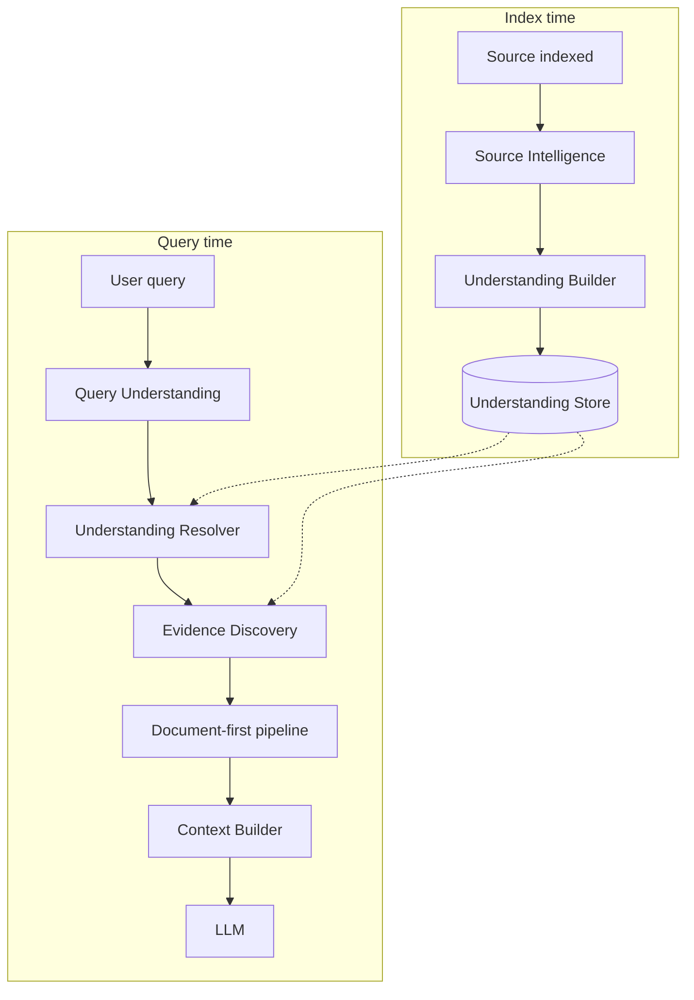
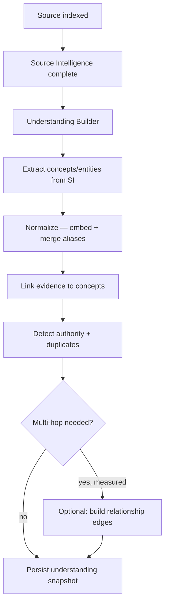
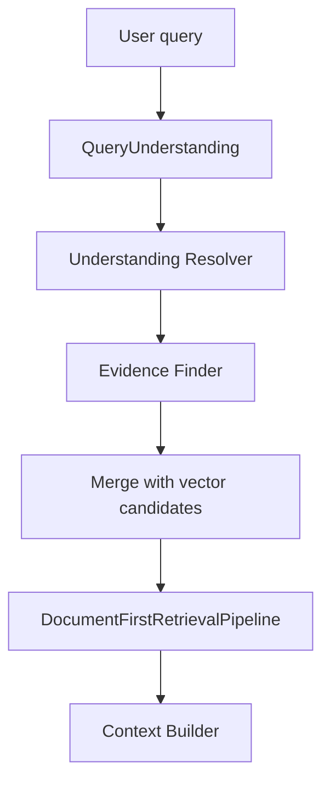

# Semantic Understanding MVP — Design

Near-term implementation path toward the vision in `docs/KNOWLEDGE_INTELLIGENCE_ENGINE.md`.

Design for the next architectural layer: **maximize semantic understanding of indexed knowledge** — the first concrete step toward **Knowledge Memory** and **Knowledge Reasoning**.

This is **not** a graph project. A knowledge graph is only one possible internal representation. Vectors, clusters, embeddings, summaries, and relational indexes are equally valid — whichever best helps the system **understand** the knowledge.

---

## 0. Core principle

> **The goal is understanding. Everything else is implementation.**

| Wrong framing | Correct framing |
|---------------|-----------------|
| Build a knowledge graph | Build a system that understands indexed knowledge |
| Graph-driven architecture | Understanding-driven architecture |
| Retrieval searches a graph | Retrieval is a **consequence** of understanding |
| Success = nodes and edges | Success = correct evidence selected for the user's need |
| Optimize graph structure | Optimize semantic resolution quality |

**Rules:**

1. Never build internal structures for their own sake.
2. Choose representations based on what improves understanding — not aesthetics or fashion.
3. If a flat concept index outperforms graph traversal for this site, use the index.
4. If embeddings + SI profiles are sufficient, do not add a graph.
5. The engine must stay **architecture-driven**, not **graph-driven**.

Internal structures are **pluggable implementation details** behind a stable understanding interface.

---

## 1. Problem statement

Today:

```
Index → Source Intelligence (per-page) → stored on Source row
Query → Query Understanding → vector/lexical search → SI compatibility scoring → context
```

**Gap:** Source Intelligence understands **individual pages**, but the engine has no **site-wide semantic model** of what knowledge exists, how it relates, what is canonical, and what evidence answers which questions.

The gap is **missing understanding** — not missing a graph.

Per-source data already exists (`intelligence_json`, `topics_json`, `keywords_json`, `canonical`, `importance`). It is not unified, queryable, or used to route evidence at the site level.

**MVP goal:** introduce a **Knowledge Understanding Layer** that aggregates per-source intelligence into a site-wide semantic model, then use that model to improve evidence selection — without prescribing how it is stored internally.

---

## 2. Design principles

| Principle | MVP implication |
|-----------|-----------------|
| **Understanding first** | Every feature must answer: *does this help the system understand the knowledge better?* |
| **Representation-agnostic** | Expose capabilities (resolve concepts, find evidence, detect gaps), not graph APIs |
| **No predefined ontology** | Concepts emerge from SI; no industry type tables |
| **No hardcoded domain rules** | Extract from `SourceSemanticProfile` + embeddings — not regex entity lists |
| **Inference over config** | Understanding model rebuilds automatically; no admin ontology editor |
| **Retrieval follows understanding** | Query resolves to knowledge need → understanding layer finds evidence → existing pipeline ranks it |
| **Explainability** | Diagnostics describe *why* evidence matches the understood need — not internal structure names |

---

## 3. Target architecture



**Knowledge Understanding Layer (KUL)** — stable interface, swappable internals:

| Capability | Question it answers |
|------------|---------------------|
| `resolve_query` | What knowledge does this query need? |
| `find_evidence` | Which sources contain that knowledge? |
| `canonical_for` | Which source is authoritative for this knowledge? |
| `related_knowledge` | What adjacent knowledge might help? |
| `coverage_gaps` | What knowledge is missing or weak? |
| `explain_match` | Why does this evidence fit the need? |

Implementations may use graphs, indexes, vector stores, or hybrids — callers do not care.

---

## 4. Current assets to reuse

**Already production-ready:**

- `SourceSemanticProfile` — per-page understanding (topics, purpose, suitability, keywords)
- `SourceIntelligenceService` — structural + semantic profiles
- `QueryUnderstandingService` — query-side understanding
- `SemanticCompatibilityScorer` — evidence ↔ query compatibility
- `DocumentFirstRetrievalPipeline` — evidence ranking and selection

**Preview-only / do not extend as-is:**

- `knowledge_profile_generation/knowledge_graph.py` — category-centric, capped, not wired to retrieval
- `entity_extractor.py` `_ENTITY_PATTERNS` — domain-specific; violates Zero Hardcode Policy

---

## 5. MVP scope

### In scope

1. **Understanding Store** — persistent site-wide semantic model (representation TBD by what works best)
2. **Understanding Builder** — aggregates SI profiles after indexing; incremental updates
3. **Concept normalization** — merge aliases via embedding similarity (not string rules)
4. **Understanding Resolver** — maps `QueryUnderstanding` → knowledge need → candidate evidence
5. **Evidence routing** — inject understanding-matched sources into document-first pipeline (shadow, then assist)
6. **Diagnostics** — `understanding_trace` with human reasoning (not internal structure dumps)
7. **Coverage view** — read-only admin panel: what the system understands, gaps, canonical sources

### Out of scope

- Mandating a graph database or graph schema
- Replacing vector search
- Admin-editable ontologies
- Building structures that do not improve understanding metrics
- Graph neural networks / external graph engines (unless proven necessary later)

### Representation decision (make empirically, not upfront)

Evaluate candidates against understanding quality — not architectural preference:

| Representation | Good when | Weak when |
|----------------|-----------|-----------|
| **Concept index** (concept → source_ids) | Most queries need direct concept→evidence lookup | Multi-hop reasoning dominates |
| **Embedding index** (concept vectors) | Fuzzy/alias matching, cross-language | Need explicit authority/duplicate edges |
| **Relational graph** | Explicit relationships improve resolution | Simple sites; overhead exceeds benefit |
| **Semantic clusters** | Broad/overview queries; topic discovery | Precise fact lookup |
| **Enhanced SI only** | Small sites; SI already rich | Large sites; duplicate/convergence detection |

**MVP default:** start with **Concept Index + embedding merge** — simplest path to site-wide understanding without committing to graph traversal. Add graph edges only if multi-hop evidence routing measurably improves results.

---

## 6. Understanding model (logical, not storage)

What the system must **understand** about a site — independent of storage:

### Knowledge units

| Unit | Meaning | Source |
|------|---------|--------|
| **Concept** | A topic the site explains | SI `main_topic`, `subtopics`, merged keywords |
| **Entity** | A named thing the site describes | SI `entity_type` + title/keywords |
| **Evidence** | A source that contains knowledge | One per indexed `Source` |
| **Authority** | Which evidence is canonical | `Source.canonical`, SI confidence, convergence |

### Relationships (logical)

| Relation | Meaning |
|----------|---------|
| `explains` | Evidence primarily explains a concept |
| `mentions` | Evidence references an entity |
| `supports` | Evidence duplicates/near-duplicates another |
| `related` | Concepts are semantically adjacent |
| `answers` | Concept satisfies a generic information need type |

These may be stored as graph edges, join tables, or denormalized indexes — **storage is an implementation choice**.

---

## 7. Storage (implementation detail)

Start minimal. Prefer the representation that is easiest to query for understanding resolution:

```sql
-- Site-wide understanding snapshot (versioned with knowledge_version)
understanding_snapshots (
  id, knowledge_version, concept_count, evidence_count,
  built_at, build_duration_ms, status, representation, error_message
)

-- Concept index (MVP core — may be sufficient without explicit edges)
understanding_concepts (
  id, snapshot_id, concept_key, label, aliases_json,
  embedding_blob, confidence, evidence_count, canonical_source_id
)

-- Evidence linkage (denormalized for fast lookup)
understanding_evidence (
  snapshot_id, concept_key, source_id, relation, weight, confidence
)
```

**Optional later** (only if understanding metrics justify it):

```sql
understanding_edges (snapshot_id, src_key, dst_key, relation, weight)
```

**Versioning:** rebuild when `knowledge_version` bumps or SI batch completes.

---

## 8. Build pipeline



### Module layout

```
backend/app/services/knowledge_understanding/
  __init__.py
  models.py                 # logical types: Concept, EvidenceLink, UnderstandingMatch
  interface.py              # KnowledgeUnderstandingLayer protocol
  builder.py                # SI → site-wide model
  normalizer.py             # alias merge, embedding dedupe
  store.py                  # persistence (representation-agnostic)
  resolver.py               # query understanding → knowledge need
  evidence_finder.py        # knowledge need → source candidates
  diagnostics.py            # human understanding_trace
  adapters/
    concept_index.py        # MVP default implementation
    graph_adapter.py        # optional, if graph traversal wins empirically
```

### Extraction rules (generic only)

From each source with `intelligence_json`:

| SI field | Understanding action |
|----------|---------------------|
| `main_topic` | Concept; primary `explains` link (weight = confidence) |
| `subtopics[]` | Additional concepts; weaker links |
| `search_keywords`, `synonyms`, `semantic_tags` | Concept aliases |
| `entity_type` + title/keywords | Entity if confidence > 0.4 |
| `suitable_for`, `supported_intents` | Generic need-type associations |
| `Source.canonical` | Authority marker for concept |
| Same `content_hash` | Duplicate/support relationship |

No domain regex. No industry ontologies.

---

## 9. Query-time integration

Understanding sits **between** query analysis and evidence retrieval:



### Understanding Resolver

Input: `QueryUnderstanding` + query embedding  
Output: resolved knowledge need (concepts, entities, need type)

Resolution (representation-agnostic):

1. Match query against concept labels + aliases
2. Embedding nearest-neighbor on concept vectors
3. Map intent/topic from `RetrievalIntentService` to known concepts

### Evidence Finder

Input: resolved knowledge need  
Output: ranked evidence candidates with `{source_id, understanding_score, why}`

Uses whatever internal structure resolves fastest and most accurately — concept index lookup first; graph traversal only if edges exist and add measurable value.

### Integration with existing pipeline

```python
# Understanding augments — does not replace — document-first retrieval
understanding_candidates = evidence_finder.find(resolved_need)
merged = merge_candidates(vector_candidates, understanding_candidates)
# DocumentScorer receives understanding_score as internal signal (fixed blend, not admin-tunable)
```

### Feature flag

```python
enable_knowledge_understanding: bool = False  # shadow mode: log trace, no ranking change
```

---

## 10. Diagnostics & explainability

Diagnostics describe **understanding**, not internal structure:

```json
{
  "understanding": {
    "enabled": true,
    "resolved_concepts": ["Mortgage rates"],
    "resolved_need": "specific_fact",
    "evidence_matches": [
      {
        "source_id": 42,
        "url": "/loans/mortgage",
        "why": "This source directly explains mortgage rates and is the canonical page for that topic."
      }
    ],
    "understanding_candidates": 12,
    "understanding_selected": 3
  }
}
```

No requirement to expose nodes, edges, or graph paths unless they help explain a decision.

---

## 11. Admin UX (minimal)

**No ontology editor.** Read-only understanding coverage:

| View | Purpose |
|------|---------|
| Understanding health | concept count, evidence coverage, last build |
| Top concepts | label, evidence count, canonical URL |
| Coverage gaps | concepts with weak or missing evidence |
| Query test | paste query → show resolved need + matched evidence |

Frame as "what the system understands" — not "graph explorer."

---

## 12. Phased delivery

### Phase 0 — Understanding foundation

- `KnowledgeUnderstandingLayer` interface + concept index implementation
- Understanding Builder from SI profiles
- Full rebuild on SI batch complete
- Tests: extract, normalize, resolve concepts

**Success:** system can answer "what concepts does this site explain?" and "which sources explain concept X?"

### Phase 1 — Shadow mode

- Understanding Resolver + Evidence Finder wired into pipeline (flag off)
- Log `understanding_trace` in debug payloads
- Offline eval: does understanding routing find correct evidence?

**Success:** understanding candidates overlap with ideal sources ≥ 70% on test set

### Phase 2 — Assist mode

- Soft boost in `DocumentScorer` from understanding match
- Enable via `enable_knowledge_understanding`
- Dashboard coverage panel

**Success:** measurable retrieval lift on broad/overview queries

### Phase 3 — Representation optimization

- Benchmark: concept index vs graph edges vs clusters
- Add graph adapter **only if** multi-hop routing improves understanding metrics
- Incremental updates per source
- Deprecate profile-gen preview graph → shared understanding builder

---

## 13. Success criteria

Measure **understanding quality**, not structure size:

| Metric | MVP target |
|--------|------------|
| SI → understanding coverage | ≥ 90% of SI-enriched sources linked to concepts |
| Concept dedup quality | < 5% duplicate concepts (manual sample) |
| Query resolution | ≥ 80% of test queries resolve to ≥ 1 relevant concept |
| Evidence routing | +10% "correct page in top 3" on broad/overview queries |
| Latency | Understanding resolution ≤ 20ms |
| Zero hardcode | No domain-specific rules in understanding path |
| Explainability | 100% understanding-selected docs have human `why` |

**Anti-metrics** (do not optimize):

- Node count, edge count, graph diameter
- "Graph completeness"
- Number of relationship types implemented

---

## 14. Test plan

```
tests/test_understanding_builder.py       # SI → concept/evidence links
tests/test_understanding_normalizer.py    # alias merge, no domain patterns
tests/test_understanding_resolver.py      # query → knowledge need
tests/test_understanding_evidence.py      # need → evidence candidates
tests/test_understanding_retrieval.py     # shadow + assist integration
tests/test_understanding_no_hardcode.py   # no domain tables in understanding path
```

Fixtures: generic corporate site + documentation site (not bank-only).

---

## 15. Risks & mitigations

| Risk | Mitigation |
|------|------------|
| Building graph because it sounds advanced | Decision gate: graph only if benchmarks prove multi-hop value |
| SI quality varies | Understanding layer is additive; vector search remains fallback |
| Concept explosion | Embedding merge; cap per source (1 main + 6 sub) |
| Stale understanding | Tie to `knowledge_version`; rebuild on SI batch |
| Over-engineering storage | Start with concept index; add complexity only when measured |

---

## 16. Recommended first PR

Smallest vertical slice — **understanding**, not graph:

1. `KnowledgeUnderstandingLayer` interface + concept index store
2. Understanding Builder: SI → concepts + evidence links
3. Hook: rebuild after `SourceIntelligenceGenerationService` batch
4. API: `GET /api/understanding/summary` (concepts, coverage, gaps)
5. Test: 3 sources with SI → concepts with `explains` links

No query integration yet. No graph tables. Proves the system **understands** the site.

---

## 17. Relationship to "Knowledge Graph"

A graph may emerge as **one adapter** inside the Understanding Layer if relationship traversal improves semantic resolution. It is not the product, not the milestone, and not the success metric.

```
                    ┌─────────────────────────┐
                    │  Knowledge Understanding │  ← stable interface (the goal)
                    │         Layer            │
                    └───────────┬─────────────┘
                                │
           ┌────────────────────┼────────────────────┐
           ▼                    ▼                    ▼
   Concept Index         Embedding Index      Graph Adapter
   (MVP default)          (alias matching)     (optional, if proven)
```

**Retrieval becomes a consequence of understanding** — not a search over pages, chunks, or graphs.

---

See also: `docs/ENGINEERING_MANIFEST.md` — Knowledge Understanding section.
